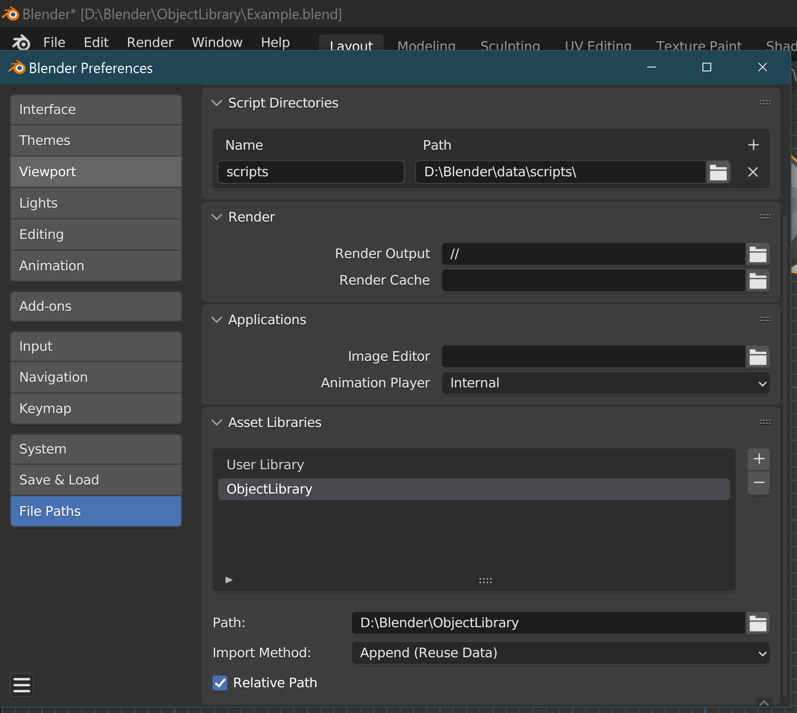

# EasyAutoAsset
A simple Blender Addon that allows for quick and easy asset and library creation using Blender's built in asset tools. It automatically adds the current path to your prefernces and saves it, allowing you to use that asset immediately in other files/project. Before, you'd have to mark as object as an asset, then manually add the file path you were working in to the file paths menu in your preferences before being able to use that asset in other files or scenes. This addon simplifies this process into a single step. Now, all one has to do is right click > mark as EasyAsset. Once the file is saved, that asset will now be ready to use in any other file by using the asset browser.

## Features

- Mark object(s), matierals, collections, etc. as assets and automatically add the current file path to Blender's asset libraries.

  
  

  

- Can add multiple items to current asset library in the viewport and outliner

  
  

    

## Installation

  1. **Download the EasyAutoAsset.py file**
    Download the latest release of EasyAutoAsset from the [releases page](https://github.com/Attaboy20/EasyAutoAsset/releases).

  2. **Install the Add-on in Blender:**
   - Open Blender.
   - Go to `Edit` > `Preferences` > `Add-ons`.
   - Click `Install...` at the top of the Add-ons window.
   - Navigate to the downloaded EasyAutoAsset.py file, select it, and click `Install Add-on`.
   - Enable the add-on by checking the checkbox next to `EasyAsset`.
  
# Report problems
If you encounter a bug or have a suggestion, feel free to [open an issue](https://github.com/Attaboy20/EasyAutoAsset/issues).

